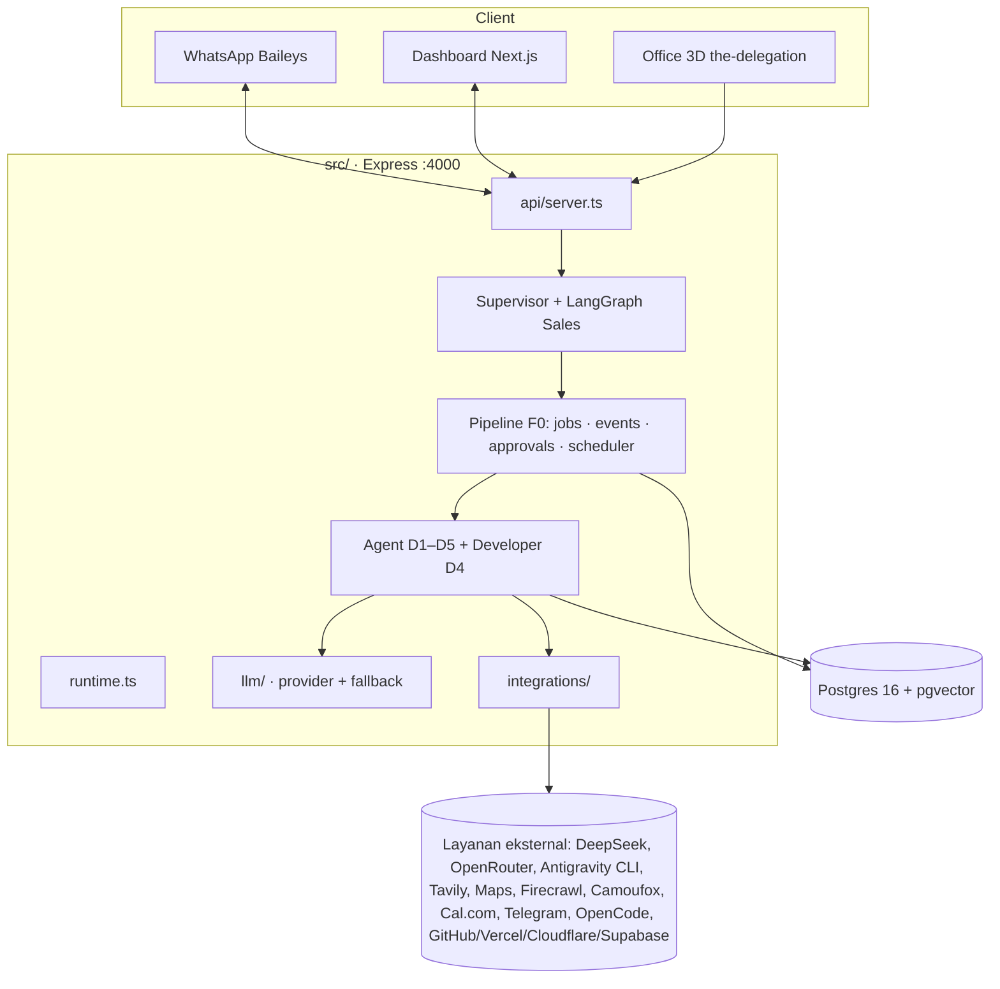
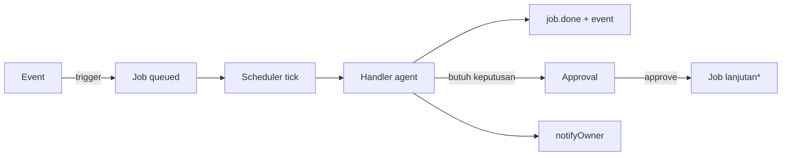
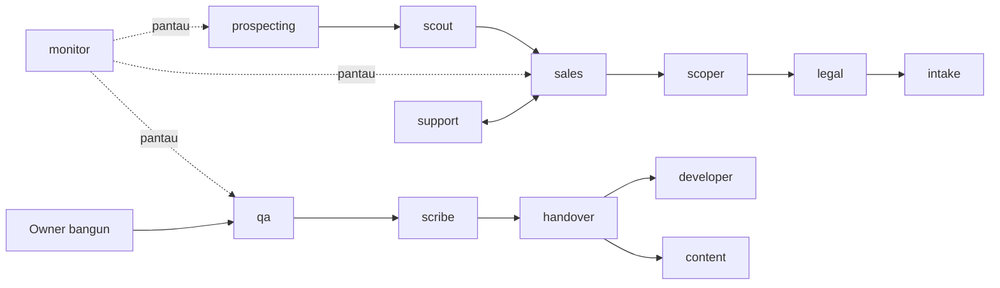
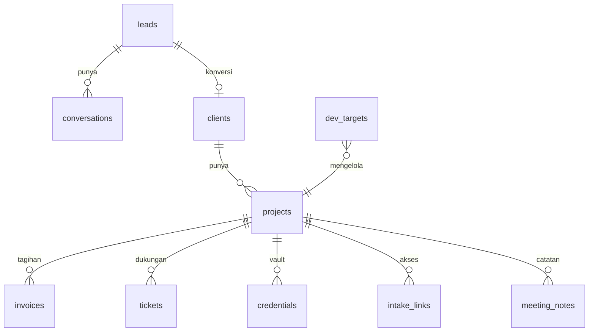
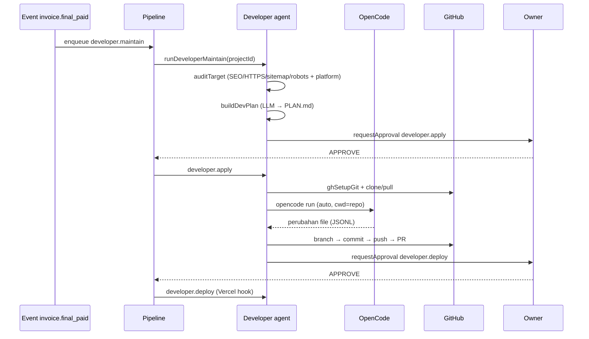

# design.md — Desain Teknis Sistem

> **Proyek:** AI Sales & Operations Agent — **PT Core Solution Digital**
> **Versi dokumen:** 1.0 · **Diperbarui:** 2026-10-07
> Dokumen ini menjelaskan **bagaimana** sistem dibangun (arsitektur & keputusan).
> Lihat `requirements.md` untuk **apa** yang dibutuhkan, dan `task.md` untuk status pekerjaan.

---

## 1. Ikhtisar arsitektur

Sistem adalah **backend Express + runtime orkestrasi** yang menjalankan banyak agent,
dengan **job queue + scheduler** internal sebagai tulang punggung, didukung Postgres
(+pgvector) untuk data, RAG, dan checkpointer.

**Entry point:**
- Produksi: `src/index.ts` → `startRuntime()`.
- Dev (PM2 `nadia-api-dev`): `scripts/api-dev.cjs` → `.playwright-cli/ui-api.ts` → `createServer()` + `startRuntime()`.
- Runtime lengkap: `src/runtime.ts` (schema, graph, transport WA, scheduler outreach+pipeline, bot Telegram).

## 2. Prinsip desain

1. **Agent = modul mandiri** dengan pola seragam: `src/<agent>/` + handler job di
   `src/pipeline/handlers/index.ts` + entri di `agentRegistry.ts` + endpoint API.
2. **Event-driven & idempoten** — aksi dipicu event; job punya `dedupeKey`.
3. **Human-in-the-loop** — aksi berisiko lewat approval.
4. **Provider LLM dapat ditukar** — override per-node + rantai fallback.
5. **Kegagalan terisolasi** — emit event/notifikasi tidak pernah melempar; platform
   eksternal dipanggil dengan pengaman (`safePlatform`).

## 3. Peta komponen backend

| Area | Modul | Peran |
| --- | --- | --- |
| Konfigurasi | `src/config/{env,logger}.ts` | Skema env (zod) & logger (pino) |
| Runtime | `src/runtime.ts`, `src/index.ts` | Boot lengkap aplikasi |
| API | `src/api/server.ts` | ~95 endpoint HTTP |
| Orkestrasi | `src/pipeline/` | jobs, events, approvals, scheduler, handlers, registry, board, commands, lifecycle |
| Agent D0 | `src/supervisor/` | Routing/penasihat, report, profil owner, briefing |
| Agent D1 | `src/prospecting/`, `src/scout/`, `src/graph/`, `src/outreach/` | Riset, audit, Sales/Nadia, outreach |
| Agent D2 | `src/scoper/`, `src/legal/`, `src/intake/` | PRD, kontrak+invoice, kredensial |
| Agent D3 | `src/qa/`, `src/scribe/` | Uji rilis, SOP |
| Agent D4 | `src/handover/`, `src/support/`, `src/monitor/`, `src/developer/` | Serah terima, L1, pemantauan, **Developer** |
| Agent D5 | `src/content/` | Studi kasus → knowledge |
| LLM | `src/llm/` | Provider + fallback + structured output |
| Integrasi | `src/integrations/` | Media, riset, jadwal, notif, dev tools |
| Memory | `src/memory/` | RAG knowledge + long-term memory |
| Improvement | `src/improvement/` | Growth + lessons/suggestions |
| WhatsApp | `src/whatsapp/` | service (Baileys), outbound (retry) |
| Research | `src/research/` | Universal Research Engine (graph) |

## 4. Orkestrasi

### 4.1. Pipeline F0 (jantung sistem)
Pola **job queue + event log + approval + scheduler**, berjalan di dalam aplikasi
(scheduler `setInterval` tiap `PIPELINE_TICK_SECONDS`). Handler didaftarkan lewat
`registerJobHandler(type, fn)`.

\* Sejak agen Developer: menyetujui `developer.apply`/`developer.deploy` otomatis
men-enqueue job eksekusinya (`APPROVAL_FOLLOWUP_JOBS` di `src/pipeline/approvals.ts`).

**State machine lead:** `discovered → scouted_ready → in_sales → won | lost | nurture`.
**Tahap proyek:** `scoping → preview → done_review → done → delivered`.

### 4.2. Roster & handoff antar-agent

**12 agent:** `supervisor, prospecting, sales, scoper, legal, intake, qa,
handover, support, monitor, developer, content` — 1 Supervisor + 11 worker.
(Beberapa entri menggabungkan dua peran: **Research & Scout** = `prospecting`+`scout`,
**QA & Documentation** = `qa`+`scribe`.)

### 4.3. Handler job terdaftar
`briefing, supervisor.review, agent.optimize, prospecting.scan, prospecting.daily,
scout.audit, scout.daily, sales.clarify, scoper.prd, legal.draft, intake.collect,
intake.expire, qa.run, scribe.docs, handover.finalize, support.triage, monitor.check,
content.case_study, developer.{maintain,build,sweep,apply,deploy}`.

### 4.4. Jadwal (Asia/Jakarta)

| Jam | Job | Keterangan |
| --- | --- | --- |
| 03:00 | `intake.expire` | Tutup link intake kedaluwarsa |
| 07:00 | `agent.optimize` | Loop usulan perbaikan |
| 08:00 | `briefing` → `monitor.check` + `supervisor.review` | Briefing harian owner |
| 09:00 | `prospecting.daily` | Kejar target lead harian |
| 10:00 | `scout.daily` | Audit lead → `scouted_ready` |
| 11:00 | `developer.sweep` | Audit situs/repo terpasang |
| 08:00–17:00 | outreach tick | Outbound (hari kerja) |

## 5. Data model (Postgres + pgvector)

| Kelompok | Tabel |
| --- | --- |
| CRM & percakapan | `leads, conversations, evaluations, bookings, outreach_log` |
| Riset | `research_reports` |
| Bisnis F0 | `clients, projects, invoices, tickets, credentials, client_channels, meeting_notes, intake_links` |
| Orkestrasi | `events, jobs, approvals` |
| Memory & pembelajaran | `knowledge_docs, long_term_memory, agent_improvements, supervisor_chat` |
| Developer (baru) | `dev_targets` |
| LangGraph | tabel checkpointer (dibuat oleh `@langchain/langgraph-checkpoint-postgres`) |

Skema di `sql/init.sql` (idempoten, dijalankan tiap boot oleh `src/db/schema.ts`).

## 6. Lapisan LLM (`src/llm/`)

- Provider: **deepseek** (default), **antigravity** (CLI `agy`), **openrouter**.
- `LLM_PROVIDER`, `LLM_PROVIDER_OVERRIDES` (per `name`), `LLM_FALLBACK_PROVIDERS` (rantai),
  `LLM_FALLBACK_TO_DEEPSEEK`.
- API: `structuredInvoke({schema, system, human, name, temperature, maxTokens, provider})`
  dan `textInvoke(...)`.
- Structured output mencoba function calling → json mode → ekstraksi JSON.

## 7. WhatsApp (`src/whatsapp/`)

- **Baileys** (unofficial) atau transport `console` (dev).
- Anti-balasan dobel: dedup `messageId` + antre per-kontak.
- Identitas lead memakai `senderPn` (nomor); lead `@lid` lama di-merge (`mergeLeadByJid`).
- Pesan gagal dikirim di-retry (tunggu koneksi). Typing indicator + pacing sesuai panjang pesan.

## 8. Integrasi eksternal (`src/integrations/`)

| Integrasi | Fungsi |
| --- | --- |
| `maps.ts` | Scraping Google Maps (prospecting) |
| `tavily.ts` | Search + extract (enrichment/discovery) |
| `firecrawl.ts`, `camoufox.ts` | Mesin ingestion riset |
| `whisper.ts` | Voice note → teks (faster-whisper lokal) |
| `vision.ts` | Deskripsi gambar (DeepSeek vision) |
| `pdf.ts` | Dokumen PDF (pdfkit) |
| `calcom.ts` | Penjadwalan (MCP Cal.com — perlu perbaikan auth) |
| `telegram.ts` | Notifikasi owner + bot kanal L1 |
| **`opencode.ts`** | Engine OpenCode headless (`opencode run`, parsing JSONL) |
| **`github.ts`** | `gh` + git (clone/branch/commit/push/PR) |
| **`devplatforms.ts`** | Vercel, Cloudflare, Supabase, Search Console, Analytics |
| **`cloudflareR2.ts`** | Cloudflare R2 (S3-compatible): list/put/get/delete objek (SigV4 sendiri, tanpa dependensi) |

## 9. Subsistem Developer (D4) — desain

**Tujuan:** menggantikan Retainer; mengelola situs terpasang (SEO/performa/keamanan)
dan membangun otomasi/AI agent, dengan OpenCode sebagai engine dan GitHub sebagai
kanal perubahan, **di balik approval owner**.

**Modul:** `src/developer/{run,plan,repository,types}.ts`, `dev_targets` (DB),
`src/integrations/{opencode,github,devplatforms}.ts`.

**Keputusan penting pada engine OpenCode:**
- Output OpenCode adalah **JSON Lines** (`step_start`, `text`, `error`) → parser
  mengumpulkan `part.text`, mendeteksi event `error`.
- Di Windows, `opencode` adalah shim `.cmd`; Node 24 menolak spawn `.cmd` (EINVAL).
  `resolveBinary()` membaca shim dan mengembalikan `.exe` asli
  (`...\@opencode\cli\bin\opencode.exe`) → spawn tanpa shell (aman untuk argumen
  multi-baris & path berspasi).
- Model dapat diatur via `DEVELOPER_OPENCODE_MODEL` (kosong = default OpenCode).

**Pemisahan tanggung jawab:** OpenCode hanya *mengubah file*; commit/push/PR/deploy
dilakukan backend → kontrol penuh & bisa diaudit.

## 10. Dashboard (`dashboard/`)

Next.js 16 + shadcn/ui + React Flow. Halaman: Control Room (`/`), `workflow`,
`leads` + detail, `projects` + detail, `invoices`, `tickets`, `knowledge`, `pipeline`,
`kualitas`, `pertumbuhan`, `supervisor`, `booking`, `operasional`, `pengaturan`,
`approvals`, `agents/[slug]` (redirect ke workflow). Data dari endpoint backend.
Topologi bisnis & pengalaman agent didefinisikan di `src/lib/{business-topology,agent-experience}.ts`.

## 11. Kantor 3D (`the-delegation/`)

Vite + Three.js. Menampilkan 14 workstation dalam 6 ruangan divisi; status agent
diambil live dari backend `/agents/status` (`src/integration/officeBackend.ts`).
Roster & divisi di `src/data/officeLife.ts`; ruangan di `simulation/world/companyOffice.ts`.

## 12. Konfigurasi (`.env`)

Kelompok utama: LLM (DeepSeek/Antigravity/OpenRouter), database & embedding, WhatsApp,
media (Whisper/Vision), outreach, pipeline & notifikasi (owner, briefing, approval),
prospecting, scoper, legal, F2–F5 toggles, Telegram, **Developer** (engine OpenCode,
workspace, sweep, token platform). Contoh lengkap di `.env.example`.

## 13. Keamanan

- **Vault kredensial** AES-256-GCM (`APP_SECRET`); nilai rahasia tidak ditulis ke disk proyek.
- **`.env` tidak di-commit** (berisi kunci).
- `API_KEY` opsional menggerbangi endpoint webhook/aksi.
- `DRY_RUN=true` untuk uji tanpa mengirim WhatsApp asli.
- **Approval** untuk aksi berisiko (handover, developer apply/deploy).

## 14. Observability

- **Event log** (`events`) sebagai outbox & jejak.
- **Lesson per job** (`agent_improvements`) → loop perbaikan.
- **Briefing harian** + **supervisor.review** + **monitor.check**.
- Log **PM2** (`npx pm2 logs nadia-api-dev`); status engine via `/llm/status`.

## 15. Keputusan teknis penting (ADR ringkas)

| # | Keputusan | Alasan |
| --- | --- | --- |
| 1 | Job queue + scheduler internal (bukan broker eksternal) | Sederhana, cukup untuk skala agensi, mudah di-PM2 |
| 2 | Event-driven + `dedupeKey` | Idempoten & tahan restart |
| 3 | Approval sebagai mekanisme kontrol | Owner tetap memutuskan aksi berisiko |
| 4 | Rantai fallback LLM + override per-node | Tahan rate-limit, optimasi biaya/kecepatan |
| 5 | Baileys (unofficial) | Tanpa biaya API resmi; cukup untuk operasional |
| 6 | Developer pakai OpenCode + GitHub (bukan patch langsung) | Perubahan dapat diaudit (PR) & engine kode yang kuat |
| 7 | OpenCode via CLI headless + resolve `.exe` | Menghindari masalah shim `.cmd` di Windows |
| 8 | Division D4 menyatukan Developer (bukan divisi baru) | Office 3D mendukung 6 ruangan; organisasi lebih ringkas |

## 16. Risiko & mitigasi

| Risiko | Mitigasi |
| --- | --- |
| Rate limit model gratis | Rantai fallback ke DeepSeek; override provider per-node |
| OpenCode default tanpa kredit (402) | Isi `DEVELOPER_OPENCODE_MODEL` dengan model berkredit |
| Cal.com auth 401 | Perbaiki `CAL_API_KEY`/OAuth |
| Baileys = unofficial (bisa berubah) | Transport `console` untuk dev; retry kirim |
| Perubahan kode otomatis berisiko | Approval + PR (bukan push ke `main` langsung) |
| Data kredensial bocor | Vault terenkripsi + tidak menulis rahasia ke disk |
| Prospek/nomor duplikat | Dedup di Riset: skip bila `wa_jid` atau bisnis (nama+alamat/situs) sudah ada; loop harian lanjut ke niche baru |
