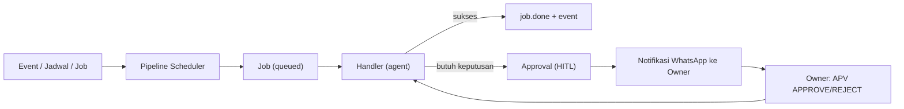

# Pipeline Bisnis — F0 (Fondasi Orkestrasi)

Dokumen ini menjelaskan fondasi agar roda bisnis AI Automation bisa berjalan
**otonom** di atas sistem multi-agent yang sudah ada (Sales, Research,
Supervisor). F0 bukan agen baru — ia adalah **mesin orkestrasi** yang dipakai
semua agen berikutnya (Prospecting, Scout, Scoper, Legal, QA, L1, dst).

## Dua mode orkestrasi

| Mode | Pemicu | Contoh agen | Status |
| --- | --- | --- | --- |
| **Turn-based** | pesan masuk | Sales, L1 Support, riset chat | ✅ ada |
| **Event/schedule** | event bisnis / jadwal | Scout, Scoper, Legal, Monitor, Retainer, Briefing | ✅ **F0** |

Mode kedua inilah yang membuat bisnis "berjalan sendiri": agen bereaksi pada
perubahan state entitas (`Prospect → Client → Project → Delivered → Retained`)
dan pada jadwal (harian, 30 hari, dsb) — bukan menunggu chat.

## Komponen F0

```
src/pipeline/
  types.ts        # Job, Event, Approval + handler contract
  repository.ts   # CRUD jobs / events / approvals
  events.ts       # emitEvent() — outbox/observability
  jobs.ts         # enqueue + claim + run (dispatch ke handler)
  registry.ts     # peta tipe job → handler
  entities.ts     # query entitas bisnis (projects, tickets, …)
  approvals.ts    # requestApproval / decideByPrefix (HITL)
  commands.ts     # perintah owner via WhatsApp
  scheduler.ts    # tick berkala memproses job
  handlers/
    briefing.ts   # Daily Briefing + penjadwalan harian
    index.ts      # registrasi handler + re-export
src/notifications/  # notifyOwner() ke WhatsApp owner
```

## Entitas bisnis (Postgres)

| Tabel | Isi |
| --- | --- |
| `clients` | Klien (konversi dari lead) |
| `projects` | Proyek + `stage` (scoping→building→qa→handover→delivered→retained) |
| `invoices` | DP / final / retainer |
| `tickets` | Tiket dukungan (severity l1/l2/emergency) |
| `credentials` | Vault kredensial terenkripsi |
| `events` | Log event bisnis (outbox) |
| `jobs` | Antrean job terjadwal (idempoten via `payload.dedupeKey`) |
| `approvals` | Persetujuan owner (human-in-the-loop) |

## Alur



## Cara kerja job

1. Sebuah proses memanggil `enqueueJob({ type, payload, runAt })`.
   Bila `payload.dedupeKey` sudah ada, job tidak diduplikasi.
2. Scheduler (`startPipelineScheduler`) tiap `PIPELINE_TICK_SECONDS` mengambil
   job yang jatuh tempo (`claimDueJobs`, `FOR UPDATE SKIP LOCKED`).
3. Handler terdaftar dijalankan. Sukses → `job.done`; gagal → dicoba ulang
   (hingga `max_attempts`) lalu `failed`.

## Menambah pekerjaan/agen baru

```ts
// src/pipeline/handlers/scout.ts
import { registerJobHandler } from "../registry.js";

registerJobHandler("scout.audit", async (job) => {
  // ...jalankan agen, simpan hasil, emit event...
  return { ok: true, note: "audit selesai" };
});
```

Daftarkan di `handlers/index.ts` (`registerCoreJobHandlers`), lalu enqueue job
`scout.audit` dari alur sebelumnya (mis. setelah prospecting selesai).

## Approval (human-in-the-loop)

- `requestApproval({ kind, title, summary })` → simpan + notifikasi ke owner.
- Owner membalas di WhatsApp: `APV APPROVE <id>` / `APV REJECT <id> <catatan>`.
- Perintah owner lain: `BRIEFING`, `STATUS`, `PENDING`, `TICK`, `HELP`.
- Pesan dari owner **tidak** dirutekan ke agent; ditangani lebih dulu di
  `handleSupervisorTurn`.

## Endpoint

| Method | Path | Fungsi |
| --- | --- | --- |
| `GET` | `/pipeline/snapshot` | Ringkasan pipeline (data briefing) |
| `GET` | `/pipeline/jobs` | Daftar job |
| `POST` | `/pipeline/jobs` | Enqueue job |
| `GET` | `/pipeline/job-types` | Tipe job terdaftar |
| `POST` | `/pipeline/tick` | Proses job jatuh tempo sekarang |
| `GET` | `/pipeline/events` | Log event |
| `POST` | `/briefing/run` | Jalankan briefing sekarang |
| `GET` | `/approvals` | Daftar approval (`?status=pending`) |
| `GET` | `/approvals/:id` | Detail approval |
| `POST` | `/approvals` | Minta approval baru |
| `POST` | `/approvals/:id/approve` \| `/reject` | Putuskan approval |

## Konfigurasi

| Variabel | Default | Keterangan |
| --- | --- | --- |
| `PIPELINE_ENABLED` | `true` | Aktifkan scheduler |
| `PIPELINE_TICK_SECONDS` / `PIPELINE_BATCH` | `30` / `5` | Irama & batch job |
| `PIPELINE_MAX_ATTEMPTS` | `3` | Batas percobaan job |
| `NOTIFY_ENABLED` | `true` | Aktifkan notifikasi owner |
| `OWNER_WA_JID` | – | **Wajib** untuk notifikasi & perintah owner |
| `OWNER_NAME` | `Owner` | Label owner |
| `BRIEFING_ENABLED` / `BRIEFING_HOUR` / `BRIEFING_TIMEZONE` | `true` / `8` / `Asia/Jakarta` | Daily briefing |
| `APPROVAL_TTL_HOURS` / `APPROVAL_PREFIX` | `72` / `APV` | Approval |
| `APP_SECRET` | – | Kunci enkripsi vault (F2) |

> **Penting:** isi `OWNER_WA_JID` dengan nomor WhatsApp Anda (format
> `62812xxxxxxx@s.whatsapp.net`). Tanpa itu, briefing tetap dibuat tetapi tidak
> terkirim, dan perintah owner tidak aktif.

## Fase berikutnya (roadmap)

F0 → **F1** Prospecting (Maps) + Scout → **F2** Scoper/PRD + Legal/Finance +
Intake → **F3** QA + Documentation → **F4** Handover + L1 + Monitor + Retainer →
**F5** Case Study/Content (flywheel).
